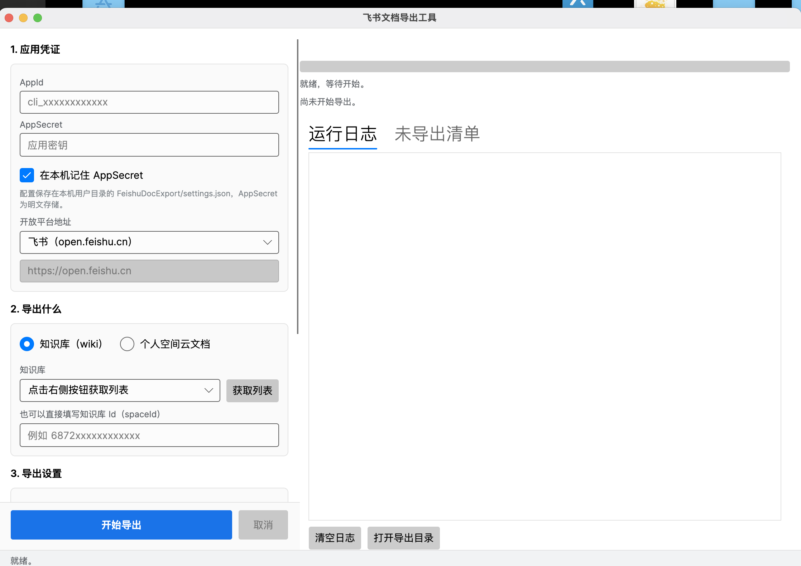

# feishu-doc-export

一个支持 **Windows / macOS / Linux** 的飞书文档导出工具，可以把飞书**知识库**或**个人空间云文档**的全部文档同步到本地，目录结构与原知识库保持一致。支持导出 `docx`、`pdf`、`markdown` 三种格式，表格类文档导出为 `xlsx`，云空间里的普通文件（pdf/zip/图片等）按原格式下载。

提供两种使用方式：

- **图形界面（推荐）**：`feishu-doc-export-gui`，填表 → 选知识库 → 点开始，实时看进度和失败清单。
- **命令行**：`feishu-doc-export`，适合挂机批量跑、写进脚本或定时任务。

实测 700 多个文档导出耗时约 25 分钟（后台运行，不影响正常工作）。

---

## 一、准备工作（两种方式都需要）

### 1. 获取 AppId 和 AppSecret

- 进入飞书[开发者后台](https://open.feishu.cn/app)，创建**企业自建应用**，信息随意填写。
- 打开**权限管理**，开通以下权限（注意有分页）：
  - 查看新版文档
  - 查看、评论和下载云空间中所有文件
  - 查看、评论和导出文档
  - 查看、评论、编辑和管理云空间中所有文件
  - 查看、评论、编辑和管理多维表格
  - 查看、编辑和管理知识库
  - 查看、评论、编辑和管理电子表格
  - 导出云文档
- 打开**添加应用能力**，添加**机器人**。
- 在**版本管理与发布**中创建版本并申请发布上线（等待管理员审核；仅测试时可创建测试企业与测试版本）。
- 回到**凭证与基础信息**，获取 `App ID` 和 `App Secret`。

### 2. 给应用授权知识库

- 在飞书桌面客户端创建一个群组，把上面创建的应用作为**群机器人**加进去。
- 打开知识库 → **知识空间设置** → **成员管理** → **添加管理员**，选择刚刚建立的群组。

> 个人空间云文档不支持列举文件夹，必须先把目标文件夹**分享给自建应用**，再手动填写 `folderToken`。

### 3. 获取知识库 Id / folderToken

知识库 Id（`spaceId`）可以从知识库设置页的 URL 中获取；`folderToken` 可以从文件夹分享链接中获取。

---

## 二、图形界面使用



启动 `feishu-doc-export-gui` 后，左侧按 1→2→3 的顺序填写：

1. **应用凭证**：AppId、AppSecret；开放平台地址默认飞书（国内），国际版 Lark 选第二项，也可以选「自定义」手填。
2. **导出什么**：选「知识库」后点 **获取列表**，从下拉框挑一个知识库（也可以直接手填 `spaceId`）；选「个人空间云文档」则填 `folderToken`。
3. **导出设置**：选择导出目录、保存格式；如果导出 markdown，建议指定 Aspose.Words 许可证文件。

点 **开始导出** 后，右侧会显示进度条、当前文档、运行日志，以及「未导出清单」（含不支持的类型和导出失败原因）。随时可以点 **取消** 安全中断。

界面配置会自动保存到本机：

| 系统 | 配置文件位置 |
| --- | --- |
| Windows | `%APPDATA%\FeishuDocExport\settings.json` |
| macOS / Linux | `~/.config/FeishuDocExport/settings.json` |

> `AppSecret` 以明文保存在该文件中。如果不希望落盘，取消勾选「在本机记住 AppSecret」。

---

## 三、命令行使用

```
用法：
  feishu-doc-export --appId=<AppId> --appSecret=<AppSecret> --exportPath=<目录> [其它参数]
  feishu-doc-export                       # 不带参数时进入交互式向导
  feishu-doc-export --help                # 显示帮助

必填参数：
  --appId           飞书自建应用的 AppId
  --appSecret       飞书自建应用的 AppSecret
  --exportPath      文档导出的本地目录（需为绝对路径，不存在会自动创建）

可选参数：
  --type            导出对象：wiki（知识库，默认）或 cloudDoc（个人空间云文档）
  --spaceId         知识库 Id；不传则列出所有知识库由你选择
  --folderToken     个人空间文件夹 Token，type=cloudDoc 时必填
  --saveType        文档保存格式：docx（默认）、pdf、md
  --apiEndpoint     开放平台地址，默认 https://open.feishu.cn
                    国际版 Lark 请传 https://open.larksuite.com
  --licensePath     Aspose.Words 许可证文件路径（仅导出 md 时需要）
  --skipExisting    目标文件已存在时跳过，便于中断后重跑
  --quit            执行完直接退出，不等待按键
```

也可以通过环境变量提供凭证，避免 AppSecret 进入 shell 历史与进程列表：

```bash
export FEISHU_APP_ID=xxx
export FEISHU_APP_SECRET=xxx
./feishu-doc-export --spaceId=xxx --exportPath=/home/user/docs
```

示例：

```bash
# 导出指定知识库为 docx
./feishu-doc-export --appId=xxx --appSecret=xxx --spaceId=xxx --exportPath=/home/user/docs

# 不指定知识库，启动后从列表里选
./feishu-doc-export --appId=xxx --appSecret=xxx --exportPath=/home/user/docs

# 导出为 markdown
./feishu-doc-export --appId=xxx --appSecret=xxx --spaceId=xxx \
    --saveType=md --licensePath=/path/Aspose.Words.lic --exportPath=/home/user/docs

# 导出个人空间云文档
./feishu-doc-export --appId=xxx --appSecret=xxx --type=cloudDoc \
    --folderToken=xxx --exportPath=/home/user/docs

# 国际版 Lark
./feishu-doc-export --appId=xxx --appSecret=xxx --spaceId=xxx \
    --apiEndpoint=https://open.larksuite.com --exportPath=/home/user/docs
```

### 退出码

| 退出码 | 含义 |
| --- | --- |
| `0` | 全部成功 |
| `1` | 参数错误 |
| `2` | 部分文档导出失败（失败原因会打印在末尾清单里） |
| `3` | 致命错误或被用户取消 |

首次在 Linux / macOS 上运行需要授权：

```bash
chmod +x ./feishu-doc-export
```

---

## 四、导出格式说明

| 飞书文档类型 | 导出的文件 |
| --- | --- |
| 新版文档（docx）、旧版文档（doc） | `.docx` / `.pdf` / `.md` |
| 电子表格（sheet）、多维表格（bitable） | `.xlsx` |
| 云空间文件（file） | 按原格式下载 |
| 思维笔记、幻灯片、妙记 | **不支持**，会记入「未导出清单」 |

几处实现细节：

- 飞书开放平台**不提供 markdown 导出接口**。导出 `md` 的流程是「先让飞书导出 docx → 本地用 Aspose.Words 转成 markdown」，因此下列格式会有损失：引用语法、表格、行内代码块。工具会尽力把代码块和跨文档引用修正回来。
- markdown 里的图片会保存在**与文档同名的 `.assets` 目录**中（例如 `需求说明.md` 配 `需求说明.assets/`），同名不同文档的图片不会互相覆盖。
- 如果引用的文档也在本次导出范围内，markdown 里会写成**相对路径**；引用其他知识库或外链则保持原样。
- 同一目录下的同名文档会自动加序号（`周报.docx`、`周报 (2).docx`），不会互相覆盖。
- 文件名中的非法字符会被替换为 `-`，超长文件名按 UTF-8 字节数安全截断。

### 关于 Aspose.Words 许可证

只有**导出 markdown** 才需要 Aspose.Words（商业库）。工具按以下顺序查找许可证文件：

1. 界面上指定的路径 / 命令行的 `--licensePath`
2. 环境变量 `ASPOSE_WORDS_LICENSE`
3. 程序所在目录下的 `Aspose.Words.lic` 或 `License.lic`

**找不到许可证不会导致程序崩溃**，但转换出来的 markdown 会带上评估水印并限制文档长度，界面和日志里会给出明确提示。

---

## 五、项目结构

```
feishu-doc-export.sln
├── src/
│   ├── FeishuDocExport.Core/     核心库：飞书接口客户端、导出编排、路径生成、markdown 转换
│   ├── FeishuDocExport.Cli/      命令行入口（产物名 feishu-doc-export）
│   └── FeishuDocExport.Gui/      Avalonia 图形界面（产物名 feishu-doc-export-gui）
└── tests/
    └── FeishuDocExport.Tests/    单元测试
```

核心库不依赖任何界面框架，命令行和图形界面共用同一套导出逻辑。

---

## 六、从源码构建

需要 .NET 8 SDK。

```bash
# 编译
dotnet build feishu-doc-export.sln -c Release

# 运行测试
dotnet test tests/FeishuDocExport.Tests/FeishuDocExport.Tests.csproj

# 发布单文件可执行程序（以 macOS Apple Silicon 为例）
dotnet publish src/FeishuDocExport.Gui/FeishuDocExport.Gui.csproj \
    -c Release -r osx-arm64 --self-contained true -p:PublishSingleFile=true -o dist/osx-arm64

dotnet publish src/FeishuDocExport.Cli/FeishuDocExport.Cli.csproj \
    -c Release -r osx-arm64 --self-contained true -p:PublishSingleFile=true -o dist/osx-arm64
```

可用的运行时标识符：`win-x64`、`win-arm64`、`linux-x64`、`linux-arm64`、`osx-x64`、`osx-arm64`。

> 注意：命令行版本若要启用 `-p:PublishTrimmed=true` 裁剪，需要保留 `System.Xml` / `System.Private.Xml` 等程序集（已在 csproj 中配置），否则 Aspose.Words 的 markdown 转换会失败。

---

## 七、常见问题

**导出 markdown 后图片或文档链接打不开？**
检查 `xxx.assets` 目录是否和 `.md` 文件在一起被移动了；跨文档引用是相对路径，移动单个文件会导致链接失效。

**提示「没有阅读或导出权限」（错误码 1069902）？**
该文档没有授权给自建应用。请把文档/知识库加进应用所在的群组，或在飞书中手动下载。这类文档会被记入「未导出清单」，不影响其它文档。

**提示「应用凭证无效」？**
检查 AppId / AppSecret 是否正确，以及应用版本是否已发布并通过审核。

**导出很慢？**
速度取决于网速、飞书服务端响应和磁盘写入。`docx` 最快，`pdf` 最慢（图片内嵌）。文档是串行导出的，遇到限流会自动退避重试。

**中断后想接着跑？**
命令行加 `--skipExisting`，界面上勾选「跳过已存在的文件」，已经导出过的文档会直接跳过。

---

## 八、更新日志

### v0.0.5（图形界面版本）

- **新增 Avalonia 跨平台图形界面**：可视化配置、知识库下拉选择、实时进度条、运行日志、未导出清单、一键打开导出目录、配置持久化。
- **重构为三层结构**：核心库 / 命令行 / 图形界面共用同一套导出逻辑，命令行用法保持向后兼容。
- **修复**：Aspose 许可证路径硬编码 `/private/tmp/License.lic`（在 Windows / Linux 上必然失败）→ 改为可配置 + 自动查找 + 优雅降级。
- **修复**：`--apiEndpoint` 参数文档里有写但代码从未读取，国际版 Lark 实际不可用 → 现在真正生效。
- **修复**：下载普通文件失败后代码会继续往下走，用文件 token 去创建导出任务，产生二次报错并重复记入失败清单。
- **修复**：导出任务只识别错误码 1069902，其它异常一律吞掉并返回 null，导致文档静默丢失 → 现在全部抛出并计入清单。
- **修复**：markdown 后处理在内容不含 `|` 时抛 `ArgumentOutOfRangeException`。
- **修复**：文件名超长时用 `PadLeft` 生成「截断后」的名字，但对超长字符串 `PadLeft` 不会截断，等于没有截断 → 改为按 UTF-8 字节数安全截断。
- **修复**：同目录同名文档互相覆盖；所有文档的图片共用 `images` 目录导致图片互相覆盖 → 改为按文档独立 `.assets` 目录 + 同名自动加序号。
- **修复**：同一文档挂在多个知识库节点下时只保留最后一个路径，导致前面的引用指向不存在的文件。
- **修复**：导出任务轮询没有超时上限，飞书侧卡住时程序永久挂起 → 加入总超时与退避。
- **修复**：下载接口返回 HTTP 200 + JSON 错误体时，会把错误 JSON 当成文档写到磁盘。
- **修复**：选择知识库时 `int.Parse` 无校验、参数缺失时 `Environment.Exit(0)`（出错也返回成功退出码）。
- **改进**：新增 HTTP 限流/5xx 自动重试、`tenant_access_token` 校验与缓存、`--licensePath`/`--skipExisting`/`--help` 参数、规范的退出码、单元测试覆盖。

### v0.0.4（2023-09-27）

- 支持导出知识库内的文件类型文档（pdf、image 等）。
- 支持个人空间云文档导出（需要指定文件夹的 Token）。
- 优化程序异常处理，保证下载尽可能不中断。
- 新增命令行参数 `--type` 和 `--folderToken`。

### v0.0.3（2023-07-15）

- 新增 `markdown` 和 `pdf` 两种导出格式，新增 `--saveType` 参数。

---

## 许可证

本项目基于 [Apache License 2.0](LICENSE) 开源。

注意：项目中引用的 **Aspose.Words 是商业收费库**，需要自行购买或申请临时许可证，其授权条款不受本仓库的开源协议覆盖。
